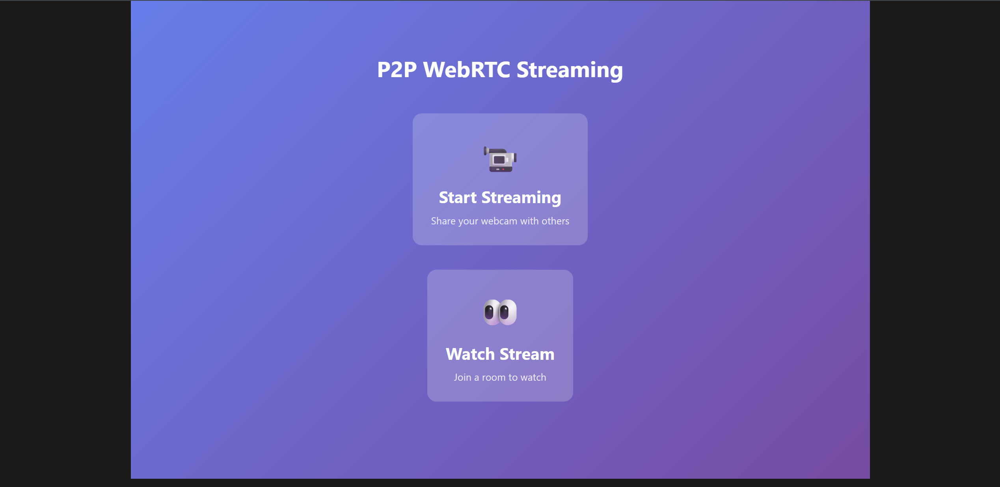
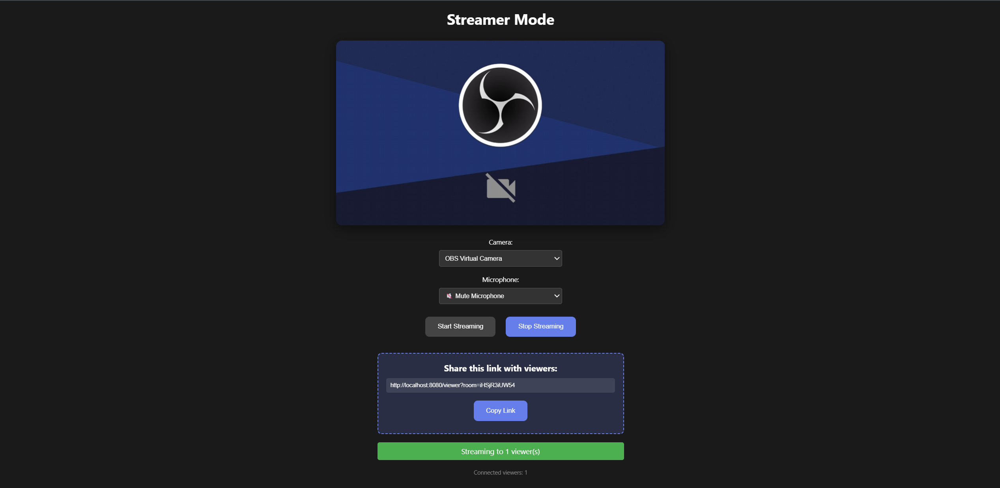
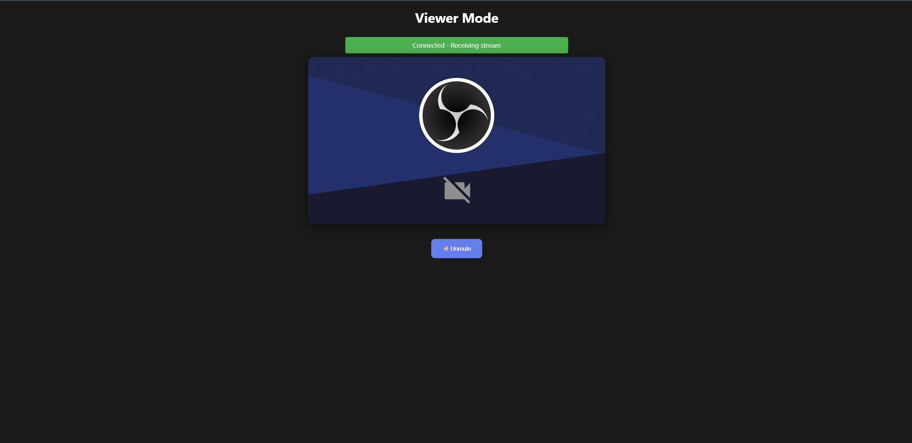

# P2P WebRTC Streaming Server

A peer-to-peer WebRTC video streaming application with a Python signaling server.







## Features

- Real-time peer-to-peer video streaming
- Multiple concurrent viewers
- Room-based streaming
- Low latency (<500ms)
- Device selection (camera/microphone)
- Mute/unmute controls

## Architecture

- **Server**: Python signaling server (handles WebSocket connections only)
- **Client**: Browser-based WebRTC (video streams directly P2P)

## Technologies

### [aiohttp](https://github.com/aio-libs/aiohttp "Github link")

Asynchronous Python web framework for handling concurrent WebSocket connections and serving the signaling server.

### [WebRTC](https://webrtc.org "Introdution about WebRTC")

Peer-to-peer technology for real-time audio/video streaming directly between browsers with low latency (<500ms).

**Browser Implementation:**

```javascript
// Create peer connection with STUN servers
const pc = new RTCPeerConnection({
    iceServers: [{ urls: 'stun:stun.l.google.com:19302' }]
});

// Add local media tracks
localStream.getTracks().forEach(track => {
    pc.addTrack(track, localStream);
});

// Create and send offer to viewer
const offer = await pc.createOffer();
await pc.setLocalDescription(offer);
ws.send(JSON.stringify({ type: 'offer', offer }));

// Handle ICE candidates for NAT traversal
pc.onicecandidate = (event) => {
    if (event.candidate) {
        ws.send(JSON.stringify({
            type: 'ice-candidate',
            candidate: event.candidate
        }));
    }
};
```

The server only exchanges signaling messages (offers/answers/ICE candidates) via WebSocket - all media flows peer-to-peer.

## Installation

1. Install dependencies:

```bash
pip install -r requirements.txt
```

2. Run the server:

**Development mode (no cache):**

```bash
python dev.py
```

**Production mode:**

```bash
python run.py
```

3. Open browser:

- Streamer: http://localhost:8080/streamer
- Viewer: Use the share link from streamer

## Project Structure

```
webrtc-streaming/
├── server/          # Python backend
│   ├── main.py      # Application initialization
│   ├── routes.py    # HTTP routes
│   ├── websocket.py # WebSocket handlers
│   ├── config.py    # Configuration
│   ├── models.py    # Data models
│   └── utils.py     # Utilities
├── templates/       # HTML templates
├── static/          # CSS and JavaScript
├── run.py          # Production entry point
└── dev.py          # Development entry point
```

## Configuration

Edit `server/config.py` to customize:

- Server host and port
- STUN servers
- Room cleanup settings

## Development

### Running Without Cache

The development mode disables Python bytecode caching to ensure fresh code on every restart:

```bash
python dev.py
```

This runs with:

- Python bytecode caching disabled (no `.pyc` files created)
- Fresh code loaded on every restart

### Clearing Cache

If you need to manually clear existing cache:

```bash
# Windows
rd /s /q server\__pycache__

# Linux/Mac
rm -rf server/__pycache__
```

## Usage

**Streamer:**

1. Go to `/streamer`
2. Select camera and microphone
3. Click "Start Streaming"
4. Share the generated link

**Viewer:**

1. Open the shared link
2. Video will autoplay (muted)
3. Click "Unmute" for audio

## Troubleshooting

**Changes not reflected after restart:**

- Use `python dev.py` to run without cache
- Manually clear `__pycache__` directories
- Restart the server to load new code

**Port already in use:**

- Change PORT in `server/config.py`
- Or kill the process using the port

## Bonus: VSCode Port Forwarding

If you're using VSCode, you can easily forward ports to access your server from other devices or share it publicly:

### Method 1: VSCode Port Forwarding Panel

1. Start your server (`python dev.py` or `python run.py`)
2. Open Command Palette (`Ctrl+Shift+P` or `Cmd+Shift+P`)
3. Type "Forward a Port" and select it
4. Enter `8080` (or your custom port from `config.py`)
5. The port will appear in the PORTS panel (bottom of VSCode)

**Options:**

- **Local Only**: Access via `localhost:8080` on your machine
- **Private**: Share with authenticated users via a URL
- **Public**: Anyone with the URL can access (use with caution)

### Method 2: Remote Development

If you're using VSCode Remote (SSH, Containers, WSL):

- Ports are automatically forwarded when detected
- Check the PORTS panel to see forwarded ports
- Click the globe icon to make a port public
- Click the lock icon to make it private

### Method 3: Manual Port Forwarding

Right-click on a port in the PORTS panel to:

- Change port visibility (Public/Private)
- Change local address
- Stop forwarding
- Copy the forwarded address

**Example:**

```
Local Address: localhost:8080
Forwarded Address: https://abc123-8080.preview.app.github.dev
```

Share the forwarded address with others to let them access your streamer/viewer!

## License

[MIT](https://github.com/S4ltF1sh/WebRTC-Streaming-Server/blob/main/LICENSE)
